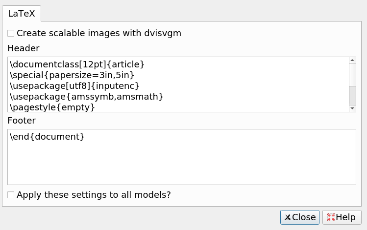

# Change the latex prefix and suffix of all note types
## Rationale
After two years of using anki, mostly for mathematics, it never
occured that the latex configuration I use depends on the note
type. 

So I added a button which allows you to set all footers and
headers to the same value.

## Warning 
If you change prefix/suffix directly in a note type's option, this
modification will be lost the first time you use this add-on again.

## Configuration
Just edit footer/header as you usually do. And click the button if you
want to apply the change everywhere.

## Internal
Version 1 used two global configurations "latexPre" and
"latexPost". If they are found, they are deleted when anki start, and
replaced by configurations. 

## Version 2.0
Anki 2.0 does not have configuration manager. Instead, to use it:
1. In main browser
2. Select "change LaTeX" 
3. Enter the LaTeX header
4. Enter the LaTeX footer

## Links, licence and credits

Key         |Value
------------|-------------------------------------------------------------------
Copyright   | 2.0 by Arthur Milchior <arthur@milchior.fr>
Copyright   | 2.1 by Ijgnord <https://github.com/ijgnd/anki__batch_change_latex_header_footer>
Based on    |Anki code by Damien Elmes <anki@ichi2.net>
License     |GNU AGPL, version 3 or later; http|//www.gnu.org/licenses/agpl.html
Source in   | https://github.com/Arthur-Milchior/anki-latex-header-footer
Addon number| [1863928230](https://ankiweb.net/shared/info/1863928230)
